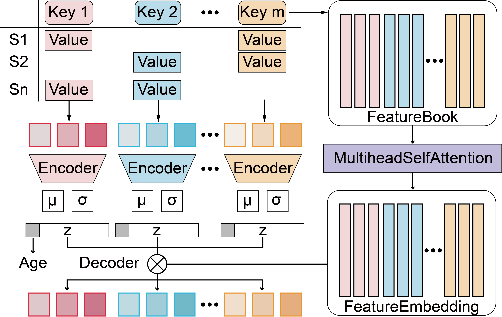

# AURORA: AI Unification and Reconstruction of Omics Reassembly Atlas



## Package: `AURORA`

We created the python package called `AURORA` that uses `scanpy` ans `torch` to integrate and generate individual multi-modality data from any modality data.

### Requirements

+ Linux/UNIX/Windows system
+ Python >= 3.8
+ torch

### Create environment

```
conda create -n AURORA python
conda activate AURORA
```

### Installation

The `AURORA` python package is in the folder AURORA. You can simply install it from the root of this repository using

```
pip install .
```

Alternatively, you can also install the package directly from GitHub via

```
pip install git+https://github.com/JackieHanLab/Aurora.git
```

### Environment has been tested

`AURORA.yaml`

## Usage

### Step 1: Configure data

```py
modalityA_h5ad.layers['counts'] = modalityA_h5ad.X
AURORA.configure_dataset(modalityA_h5ad, use_uid = <sample_ID>,use_labels = <Age_label>)
```

#### Input:

+ `modalityA_h5ad`: an `AnnData` object of modality A.
+ `<sample_ID>`: the name of the sample_ID column in `modalityA_h5ad.obs`.
+ `<Age_label>`: the name of the Age column in `modalityA_h5ad.obs`.

### Step 2: Train the model

```py
aurora_model = AURORA.fit_model(
    adatas = {"modality_A": modalityA_h5ad, 
              "modality_B": modalityB_h5ad,
              ...
              "modality_N": modalityN_h5ad}, 
    features = <features>,
    project_name = <project_name>
)
aurora_model.save("my_model.dill")
```

#### Input:

+ `adatas`: a list of configured `AnnData` object.
+ `features`: a list of all variable names of `adatas`, like: `modalityA_h5ad.var_names.to_list()`
+ `project_name`: the model will be saved in a folder named <project_name>. Default: `my_project`

### Step 3: Generation with the model

```py
#load model
aurora_model = load_model("my_model.dill")
#get sample embeddings from modality A
modalityA_h5ad.obsm["X_latent"] = aurora_model.encode_data("modality_A", modalityA_h5ad)
#generate all modality data
modality =aurora_model.net.x2z.keys()
for modality_ in modality:
    modalityA_h5ad.obsm["X_"+modality_] = aurora_model.decode_data(modality_, modalityA_h5ad,"modality_A")
```

### Cite AURORA:

[]
